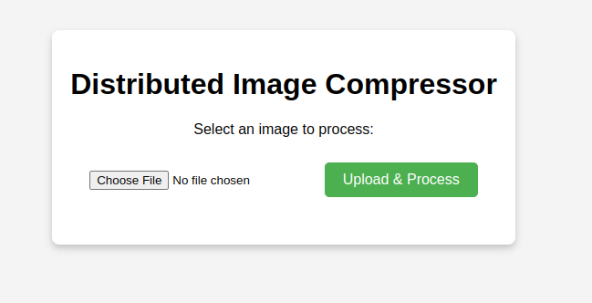

# Image Compressor

Final [CALC](https://moodle.imt-atlantique.fr/course/view.php?id=1091) project.

This project recreates an image processor app with a client where it's possible to upload images/photos and a server-side with distributed logic.


## Project Structure

This is the current project structure:

```
/
├── docker
│   ├── docker-compose.yml
│   ├── Dockerfile.consumer
│   └── Dockerfile.server
├── extras
│   └── site.png
├── LICENSE
├── README.md
└── src
    ├── client
    │   ├── assets
    │   │   └── rabbitmq-logo.jpg
    │   ├── client.js
    │   ├── index.html
    │   └── styles.css
    ├── consumer
    │   ├── core
    │   │   ├── compressor_consumer.py
    │   │   └── image_processor.py
    │   ├── main.py
    │   ├── rabbitmq
    │   │   ├── __init__.py
    │   │   ├── connection.py
    │   │   └── publisher.py
    │   ├── requirements.txt
    │   └── settings
    │       ├── config.py
    │       └── environment.py
    ├── server
    │   ├── config
    │   │   ├── __init__.py
    │   │   └── config.py
    │   ├── requirements.txt
    │   ├── server.py
    │   └── utils
    │       ├── file_handler.py
    │       └── rabbitmq.py
    └── tests
```


## Logic / Architecture

```
                                                                   +---------------------------+
                                                             ----->|     image_taks Queue      |---------------------------------------------------------
                                                             |     |   (Images inputs paths)   |                                                        |
                                                             |     +---------------------------+                    +--------------------------+        |
                                                             |                                                      |        Consumer_1        |<--------
+---------------------+       +-------------------------+    |                                             ---------|  (Distributed Workers)   |        |
|     Client (UI)     | ----> |       Flask Server      | ----                                             |        +--------------------------+        |
|                     |       |                         |                                                  |                      :                     :
|   (Upload Image)    |       |      (Task Manager)     |                                                  |                      :                     :
| (Poll for Results)  | <---- | (Aggregation & Polling) | <---                                             |        +--------------------------+        |
+---------------------+       +-------------------------+    |                                             |        |        Consumer_n        |<--------
                                                             |                                             ---------|  (Distributed Workers)   |
                                                             |    +-----------------------------+          |        +--------------------------+
                                                             |    |     result_task Queue       |          |
                                                             -----|  (Processed Outputs paths)  |<----------
                                                                  +-----------------------------+
```


## How to run the Project ?

There are two ways to run the project: locally or using Docker.

### In localhost (no containers)

First, you have to change some default parameters in the code.

You have to change the `RABBITMQ_SERVER` value in the `src/server/config/config.py` file:
```python
RABBITMQ_SERVER="localhost"
```
> The project assumes that RabbitMQ uses the default port and settings.

Then, change the settings for the `consumer` in the `src/consumer/settings/config.py` file:
```python
RABBITMQ_SERVER="localhost"
...
ROOT_STORAGE_FOLDER="../server/"
```

Check if your RabbitMQ is active on your device:
```bash
systemctl status rabbitmq
```

You have to get an output like this:
```bash
● rabbitmq.service - RabbitMQ broker
     Loaded: loaded (/usr/lib/systemd/system/rabbitmq.service; enabled; preset: disabled)
     Active: active (running) since Sun 2025-01-12 19:21:58 CET; 13s ago
 Invocation: 75aafdf3b2dd4135a33d2ad2a4efd61e
   Main PID: 63872 (beam.smp)
      Tasks: 37 (limit: 9050)
     Memory: 167.6M (peak: 181.3M)
        CPU: 3.587s
     CGroup: /system.slice/rabbitmq.service
             ├─63872 /usr/lib/erlang/erts-15.1.3/bin/beam.smp -W w -MBas ageffcbf -MHas ageffcbf -MBlmbcs 512 -MHlmbcs 512 -MMmcs 30 -pc unicode -P 1048576 -t 5000000 -stbt db -zdbbl 128000 -sbwt none -sbwtdcpu>
             ├─63883 erl_child_setup 1024
             ...
```
> It is important to notice the `Active: active (running)` status.

Now, assuming that your RabbitMQ is fully set up, let's open **two** different terminals, one for the `server` and the other for the `consumer`.

For the first terminal, you have to run the `src/server/server.py` file:
```bash
cd src/server && python3 server.py
```
> Don't forget to check the `src/server/requirements.txt` to install all dependencies.

You will get an output like this in a foreground mode:
```bash
 * Serving Flask app 'server'
 * Debug mode: off
[+] Successfully connected to localhost
[*] Waiting for messages in result_queue...
WARNING: This is a development server. Do not use it in a production deployment. Use a production WSGI server instead.
 * Running on all addresses (0.0.0.0)
 * Running on http://127.0.0.1:5000
Press CTRL+C to quit
```

Next, in the second terminal, you need to run the consumer by the `src/consumer/main.py` file:
```bash
cd src/consumer && python3 main.py
```
> Don't forget to check the `src/consumer/requirements.txt` to install all dependencies.

You will get an output like this in a foreground mode:
```bash
[*] All required environment variables are set.

[+] Successfully connected to localhost

[*] Waiting for messages in image_tasks...
```

The core is ready to use!

### Docker Config (Containers)

The project is set up to use Docker configuration. So you don't have to modify anything.

All Docker files are available in the [`docker`](./docker/) directory.

For running the project, let's open three terminals for the `rabbitmq`, `flask_server`, and `compressor_consumer_1` containers.

First, change the directory to the `docker` directory for all three terminals:
```bash
cd docker
```

Once done, the first terminal will be used as the `rabbitmq` container:
```bash
docker-compose up rabbitmq
```
> The project uses the default RabbitMQ settings.

The second terminal will be used as the `flask_server` container:
```bash
docker-compose build flask_server
docker-compose up flask_server
```

Next, the third terminal will be used as the `compressor_consumer_1` container:
```bash
docker-compose build compressor_consumer_1
docker-compose up compressor_consumer_1
```

### User Interface

Finally, open the `src/client/index.html` file with your preferred browser:
```bash
brave src/client/index.html
```
Here, `brave` is mentioned, but replace it with your preferred browser. The browser should show the following page:



---
